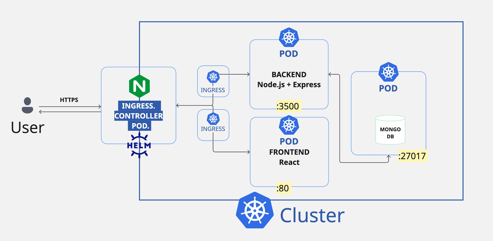

# Introduction to NGINX Ingress Controller


## NGINX Ingress Controller 

**Really helpful video: https://youtu.be/72zYxSxifpM?si=mrgufl1GRRPnfRhy**

We'll start with the documentation as always </br>
You can find the [Kubernetes NGINX documentation here](https://kubernetes.github.io/ingress-nginx/) </br>

First thing we do is check the compatibility matrix to ensure we are deploying a compatible version of NGINX Ingress on our Kubernetes cluster </br>

The Documentation also has a link to the [GitHub Repo](https://github.com/kubernetes/ingress-nginx/) which has a compatibility matrix </br>

It is needed to run docker engine, as minikube is a cluster created over Docker
* minikube start

### Get the installation YAML

The controller ships as a `helm` chart, so we can grab version `v1.5.1` as per the compatibility
matrix. </br>

From our container we can do this:

```
helm repo add ingress-nginx https://kubernetes.github.io/ingress-nginx
helm search repo ingress-nginx --versions
```

From the app version we select the version that matches the compatibility matrix. </br>

```
NAME                            CHART VERSION   APP VERSION     DESCRIPTION
ingress-nginx/ingress-nginx     4.4.0           1.5.1           Ingress controller for Kubernetes using NGINX a...
```

Now we can use `helm` to install the chart directly if we want. </br>
Or we can use `helm` to grab the manifest and explore its content. </br>
We can also add that manifest to our git repo if we are using a GitOps workflow to deploy it. </br>

```
CHART_VERSION="4.4.0"
APP_VERSION="1.5.1"

mkdir ./kubernetes/ingress/controller/nginx/manifests/

helm template ingress-nginx ingress-nginx \
--repo https://kubernetes.github.io/ingress-nginx \
--version ${CHART_VERSION} \
--namespace ingress-nginx \
> ./kubernetes/ingress/controller/nginx/manifests/nginx-ingress.${APP_VERSION}.yaml
```

### Deploy the Ingress controller 

```
kubectl create namespace ingress-nginx
kubectl apply -f ./kubernetes/ingress/controller/nginx/manifests/nginx-ingress.${APP_VERSION}.yaml
```


### Check the installation

```
kubectl -n ingress-nginx get pods
```
The traffic for our cluster will come in over the Ingress service </br>
Note that we dont have load balancer capability in `kind` by default, so our `LoadBalancer` is pending:

```
kubectl -n ingress-nginx get svc
NAME                                 TYPE           CLUSTER-IP      EXTERNAL-IP   PORT(S)                      AGE
ingress-nginx-controller             LoadBalancer   10.96.130.21    <pending>     80:31011/TCP,443:31772/TCP   26m
ingress-nginx-controller-admission   ClusterIP      10.96.125.210   <none>        443/TCP                      26m
```

For testing purposes, we will simply setup `port-forward`ing </br>
If you are running in the cloud, you will get a real IP address. </br>

```
sudo kubectl -n ingress-nginx port-forward svc/ingress-nginx-controller 443
```

We can reach our controller on [https://localhost/](https://localhost/) </br>

As there is no backend connected, nginx will report a 404 error

It's important to understand that Ingress runs on two ports `80` and `443` </br>
NGINX Ingress creates a fake certificate which is served for default `HTTPS` traffic on port `443`. </br>
If you look in the browser you will notice the name of the certificate `Common Name (CN)	Kubernetes Ingress Controller Fake Certificate` 

## Base Features (same for MERN App)

Now before we take a look at the features we'll need two web applications that we can use as our test harness, `service-a` and `service-b` </br>

In this demo, i have a deployment that runs a pod and a service that exposes the pod on port 80. </br>
This is a typical scenario where you have a micrservice you want to expose publicly. </br>

### Deploy Service A & B

Will deploy these two apps to the default namespace:

```
kubectl apply -f ./kubernetes/features/base/service-a.yaml
kubectl apply -f ./kubernetes/features/base/service-b.yaml
```

Test our service(this exposes directly the service, not throughout nginx) : `sudo kubectl port-forward svc/service-a 80`

Our services accept traffic on:

* `http://localhost/` which goes to the root `/`
* `http://localhost/path-a.html` which goes to the root `/path-a.html`
* `http://localhost/path-b.html` which goes to the root `/path-b.html`
* `http://localhost/<any-other-path>.html` which goes to the root `404`

### Routing by Domain

The most common way to route traffic with ingress is by domain:

* https://public.service-a.com/ --> Ingress --> k8s service --> http://service-a/ 
* https://public.service-b.com/ --> Ingress --> k8s service --> http://service-b/ 

To showcase this, let's deploy an ingress for service-a and service-b that routes by domain. </br>


Example Ingress:

```
apiVersion: networking.k8s.io/v1
kind: Ingress
metadata:
  name: service-a
spec:
  ingressClassName: nginx
  rules:
  - host: public.service-a.com
    http:
      paths:
      - path: /
        pathType: Prefix
        backend:
          service:
            name: service-a
            port:
              number: 80
```

<i>Note: we don't own public domain `public.my-services.com` so we're using a `/etc/hosts` file</i>

```
127.0.0.1       public.service-a.com
127.0.0.1       public.service-b.com
127.0.0.1       public.my-services.com
```

Deploy our ingresses:

```
kubectl apply -f ./kubernetes/features/base/routing-by-domain.yaml
```

sudo kubectl -n ingress-nginx port-forward svc/ingress-nginx-controller 443

Now we can access service-a and service-b on:

* https://public.service-a.com/
* https://public.service-b.com/


### Routing by Path 

Another popular routing strategy is to use a shared domain and route based on the HTTP path. For example: </br>

* https://public.my-services.com/path-a --> Ingress --> k8s service --> http://service-a/path-a 
* https://public.my-services.com/path-b --> Ingress --> k8s service --> http://service-b/path-b

This way public path `/path-a` will hit our application on `/path-a` </br>

Example Ingress: 

```
apiVersion: networking.k8s.io/v1
kind: Ingress
metadata:
  name: service-a
  annotations:
    nginx.ingress.kubernetes.io/rewrite-target: /
spec:
  ingressClassName: nginx
  rules:
  - host: public.my-services.com
    http:
      paths:
      - path: /path-a
        pathType: Prefix
        backend:
          service:
            name: service-a
            port:
              number: 80
```
Deploy our ingresses:

```
kubectl apply -f ./kubernetes/ingress/controller/nginx/features/routing-by-path.yaml
```
Now notice the following routing:

* https://public.my-services.com/ --> Ingress (404)
* https://public.my-services.com/path-a --> Ingress --> k8s service --> http://service-a/
* https://public.my-services.com/path-b --> Ingress --> k8s service --> http://service-b/

No matter what path you place on the front end, as long as the path matches `/path-a` or `/path-b` 
it will be routed to the correct service on `/` </br>
It's important to note that no extra paths or querystrings will NOT be passed to the upstream </br>

We can see this by looking at our NGINX Ingress controller logs as the controller will write the path it sees as well as the upstream service where it sent the request
```
kubectl -n ingress-nginx logs -l app.kubernetes.io/instance=ingress-nginx
```

### App Root

Sometimes applications have different root paths and don't simply serve traffic on `/` </br>
For example, the base path may be `http://localhost/home` </br>

To tell the Ingress controller that our application root path is `/home`, we can set the annotation `nginx.ingress.kubernetes.io/app-root: /home` </br>

This means the controller will be aware that all traffic that matches `path-a` should go to `/home` on service-a. </br>

### URL Rewrite 

We saw earlier when we routed by path, that we could pass `/path-a` to service-a and `/path-b` to service-b. </br>
However, the traffic would always go to `/` so we lost any trailing URL, parameters and querystring. </br>
Not very useful. </br>

To allow the Ingress controller to pass paths to the upstream you need to look into [Rewrite Configuration](https://kubernetes.github.io/ingress-nginx/examples/rewrite/)

Example Ingress:

```
apiVersion: networking.k8s.io/v1
kind: Ingress
metadata:
  name: service-a
  annotations:
    nginx.ingress.kubernetes.io/rewrite-target: /$2
spec:
  ingressClassName: nginx
  rules:
  - host: public.my-services.com
    http:
      paths:
      - path: /path-a(/|$)(.*)
        pathType: Prefix
        backend:
          service:
            name: service-a
            port:
              number: 80
```
Deploy our ingresses:

```
kubectl apply -f ./kubernetes/ingress/controller/nginx/features/routing-by-path-rewrite.yaml
```
Now notice the following routing:

* https://public.my-services.com/ --> Ingress (404)
* https://public.my-services.com/path-a* --> Ingress --> k8s service --> http://service-a/*
* https://public.my-services.com/path-b* --> Ingress --> k8s service --> http://service-b/*

```
kubectl -n ingress-nginx logs -l app.kubernetes.io/instance=ingress-nginx
```
It's important to study the logs of the Ingress Controller to learn what path it saw, where it routed to

```
127.0.0.1 - - [13/Nov/2022:02:17:47 +0000] "GET /path-a/path.html HTTP/2.0" 404 19 "-" "Mozilla/5.0 (Windows NT 10.0; Win64; x64) AppleWebKit/537.36 (KHTML, like Gecko) Chrome/107.0.0.0 Safari/537.36" 485 0.000 [default-service-a-80] [] 10.244.0.8:80 19 0.000 404 206ed4b88b712564fc073c3adb845dff
```

In the above case, the controller saw ` /path-a/path.html` , routed to service-a and we can see what our service-a saw, by looking at its logs:

```
kubectl logs -l app=service-a
10.244.0.7 - - [13/Nov/2022:02:28:36 +0000] "GET /path-a.html HTTP/1.1" 200 28 "-" "Mozilla/5.0 (Windows NT 10.0; Win64; x64) AppleWebKit/537.36 (KHTML, like Gecko) Chrome/107.0.0.0 Safari/537.36"
```

## Enabling helm.

* helm create <name>

So that this line works, there must be nothing, which is gonna be created with helm, running
* helm install <name-release> <name> (optional if we dont want to create them in default namespace)--namespace <namespace>

When we change something we use upgrade, and besides if we want to use defined values we could do the following:
* helm upgrade <name-release> <name> --values <name>/values.yaml

## Enabling CI/CD Pipeline.

Helpful video: https://youtu.be/a5qkPEod9ng?si=QT74PcBAnWdadVls

This automates the building, testing and deployment of our application, so that for example if we are working just with the node server and we want to integrate the changes within the whole project, we dont need to do all these steps (buildinf and testing)manually, as we have defined a pipeline in the .github/workflows folder

I have used Github Actions, by creating the main.yaml, defining jobs, steps within these ones and so on...

As I am pushing the used images to a private repo, it will be needed to login into docker, and for this, it will be mandatory to provide docker credentials, given in github settings/variables and secrets/actions/repository secrets 

Besides, it is needed to provide credentials also when pulling the created images in node.yaml and react.yaml, so it is needed to create a kubernetes secrets which wraps these ones
```
kubectl create secret docker-registry dockerhub-secret \            
  --docker-username={your-docker-hub-username} \
  --docker-password={your-docker-hub-password} \
  --docker-email={your-docker-hub-gmail}
```
